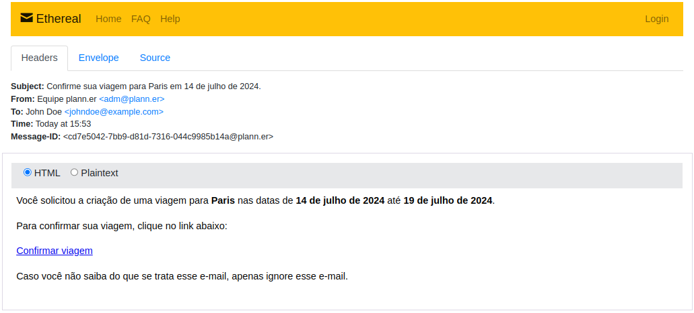
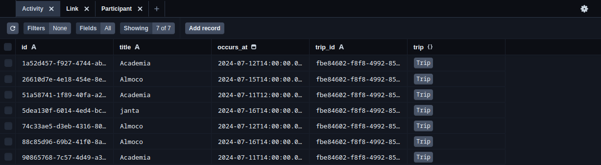

<div align="center">

  

</div>

# NodeJS Trail @ \<nlw/> 🚀

> API made for the NLW project, a travel planner, which would be integrated with a front-end (another trail from this workshop).

## Authors 👥

- For more information see my blog and my contributions to community.
  - [**@dantsec**](https://www.github.com/dantsec)

## Tech Stack 🧑‍💻

- This project was developed with the following technologies:
  - Languages:
    - [**TypeScript**](https://www.typescriptlang.org/)
    - [**NodeJS**](https://nodejs.org/en)
  - Frameworks / Others:
    - [**Fastify**](https://fastify.dev/) (Routing)
    - [**Prisma**](https://www.prisma.io/) (ORM)
    - [**Nodemailer**](https://nodemailer.com/smtp/) (Mail Sender)

## Documents 📂

- [**License**](./docs/LICENSE)
- [**API Tests @ Bruno**](./docs/bruno-api-client/)

## Installation / Run Locally ⚙️

- **Prerequisite(s)**:
  - [**NodeJS & NPM**](https://nodejs.org/)

- Clone and enter the project directory:
```bash
git clone https://github.com/dantsec/nlw-nodejs.git && cd nlw-nodejs/
```

- Install packages and prepare environment:
```bash
# !! @ CHANGE YOUR .env VARIABLES BEFORE @ !!

# Install Packages.
npm i
# Migrations.
npx prisma migrate dev
# Optional (it opens online "DBMS").
npx prisma studio
```

- Start the server or main application:
```bash
npm run dev
```

## Screenshots 📷

> Nodemailer in action.



> Prisma studio online.



## Contributing 🛠️

```bash
# Create a fork from the original repository and clone it.
git clone https://github.com/YOUR_USERNAME/nlw-nodejs.git
# Enter into the project folder.
cd nlw-nodejs/
# Create a new branch with the name feat-[BRANCH_NAME].
git checkout -b feat-[BRANCH_NAME]
# Make your changes and commit them.
git add . && git commit -m "YOUR_COMMIT_MESSAGE"
# Push your branch and open a pull request.
git push origin feat-[BRANCH_NAME]
```
